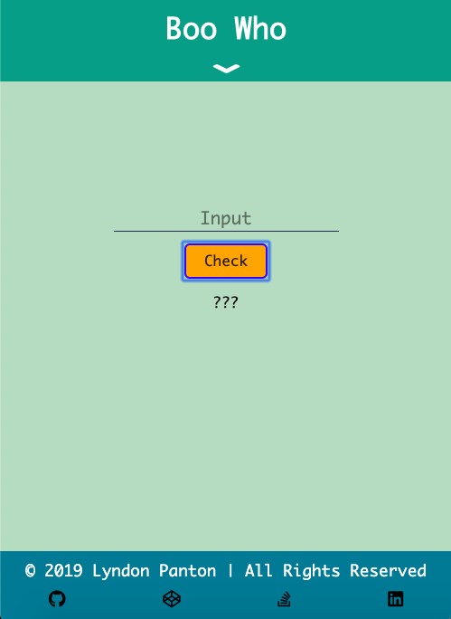
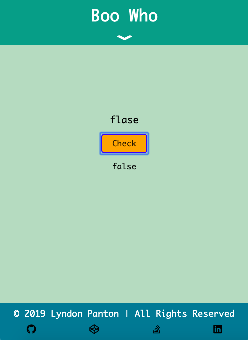
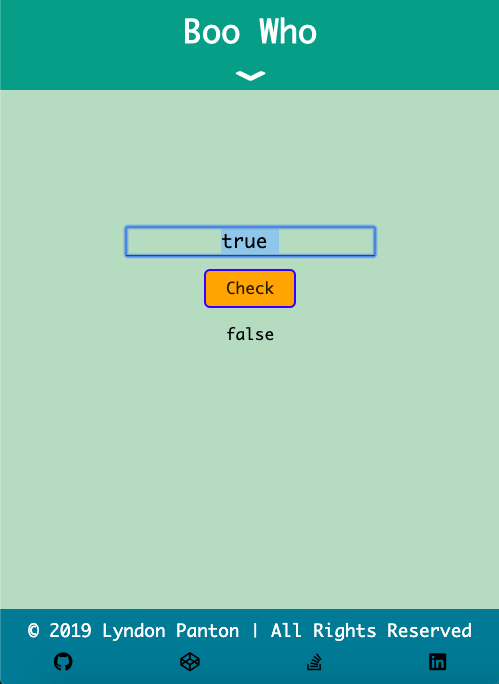
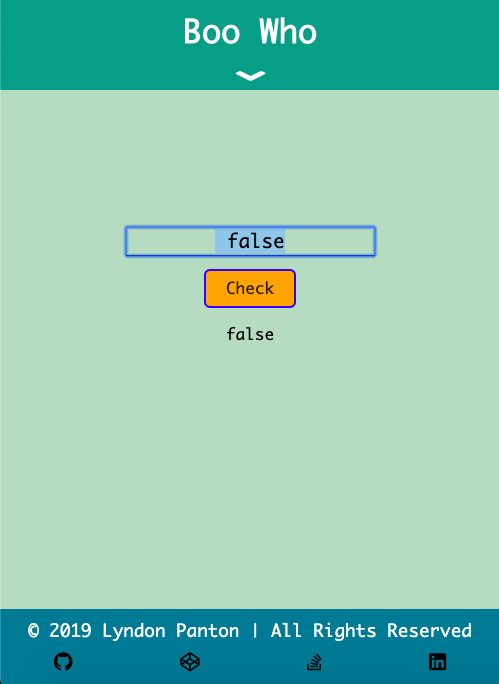

# Boo Who

## How To Open
> 1. Go to the project's download folder
> 2. Right click on the file named _index.html_
> 3. Choose the _open with_ option
> 4. Open the project in your desired browser

## How To Use
> 1. Enter a string into the input field
> 2. If the string is exactly equal to _true_ or _false_ true will be displayed, otherwise false is displayed
> 3. If the environment does not support the input event use the button to check the input, otherwise the input is checked on keystroke

## Requirements
> 1. This project requires a browser to run
> 2. The browser must have JavaScript available and enabled

## Extra Information
> 1. This was done for one of freecodecamp's Basic Algorithm Scripting activities

## Preview

